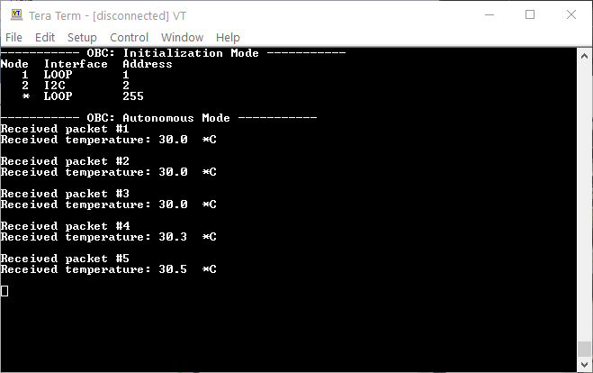
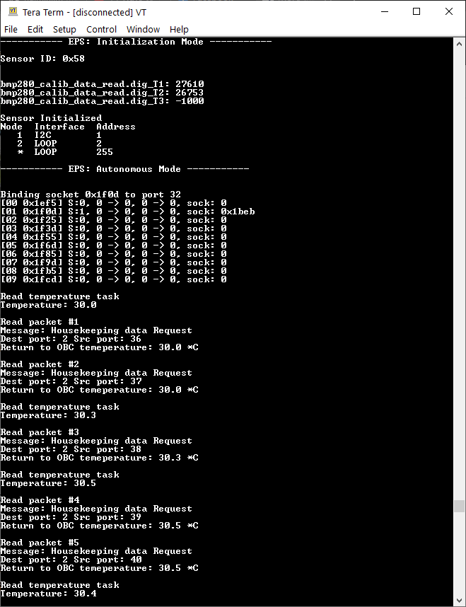

# OBC

This repo contains development of a simplified On-board Computer (OBC) of a CubeSat. 

This is part of a simplified software implementation of a CubeSat for FYP.

## About CubeSat Design

The OBC is at the heart of of the CubeSat and manages several subsystems. 

## Current Development Progress

Currently, this project is developed for the ATmega 2560 microcontroller and besides the OBC, the CubeSat design has only the EPS subsystem.

```
+---------------+                                   +---------------+
|               |                 CSP               |               |
|      OBC      |-----------------------------------|   Subsystem   |
|               |               I2C Bus             |               |
+---------------+                                   +---------------+
```

This may be expanded to accommodate other AVR microcontroller when more hardware subsystems are included in the project.

This is the expected output.

OBC output: 



Subsystem output: 


